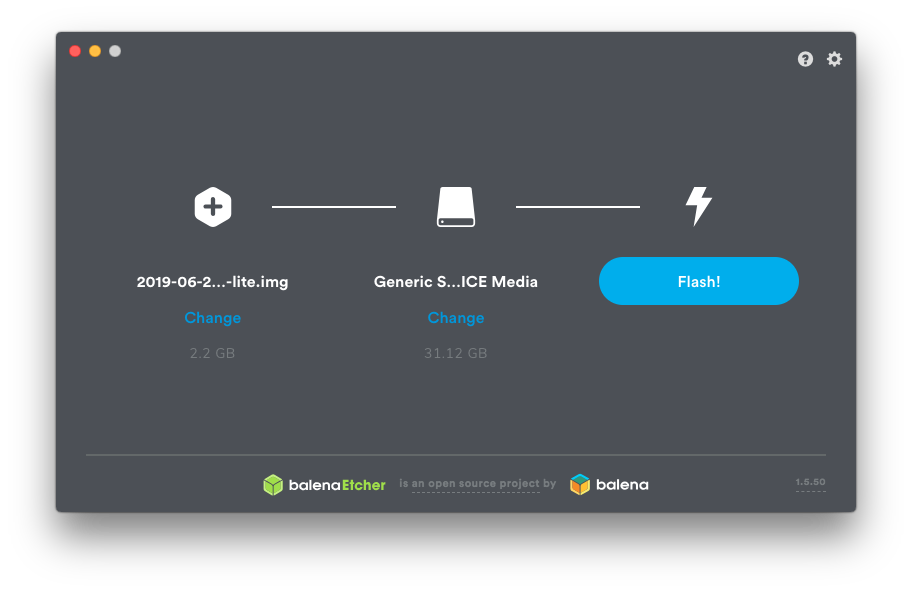

## Equipment

Perform these steps from a regular Windows, Mac or Linux computer.

1. Buy Raspberry Pi kit. I bought a [CanaKit](https://canakit.com) model from Amazon.
    
1. Download and install [Etcher](https://www.balena.io/etcher) or any other SD card flash tool.
1. Download the latest [Screenly OSE](https://github.com/Screenly/screenly-ose/releases)
    zip file and flash it to the SD card. 
1. After flashing is completed, eject this device (do it in software first).
1. Fit the card in the specific SD card slot under the Raspberry Pi board.
1. Assemble the rest of the Raspberry Pi kit, along with a keyboard, and a TV or monitor.
1. Connect the power supply last.

## WiFi (optional)

When you first turn the Raspberry Pi device, a bunch of things will fly by.
If there's no network cable connected,
you'll get to a purple screen instructing you how to setup WiFi.

## Configure what shows in the screen

After you have network, Screenly will show you a simple address to visit from your computer.
If you go there you should see the Screenly configuration panel with the Schedule Overview.

Click `Add Asset`. Paste the published presentation URL below and click `Save`.

    https://docs.google.com/presentation/d/e/2PACX-1vQ7LGi9WeOpcex-d2VXgQeT4pfHqd9h3YXWkDr9iReuKIIQMzPNBVZ5-J5xEh6wqvyO_aK858H4nQto/pub?start=true&loop=true&delayms=30000

*(At the end of this document there's an explanation on how to build a published presentation URL.)*

Turn other assets `Off` until there's only two left. I suggest leaving the Clock.
We need them to cycle so that the presentation updates are received.

On the Asset we just added, click the pencil button to edit it. ✏️

* **Name**: Presentation
* **Play for**: Forever
* **Duration**: 7200 seconds

That's all! Every two hours the presentation will be refreshed.

*We have a functional digital signage screen!*

## Install the HDMI power schedule

In order to save power and prevent volunteers from pulling the plug, we turn the screen off and on using a schedule.
The schedule is in this repository! To update it we need to push changes to this git repo.

Go to the keyboard attached to the Raspberry Pi and press `Ctrl`+`Alt`+`F1`.
You should see a black screen with a prompt at the top:

    Raspbian GNU/Linux 9 raspberrypi tty1
    raspberrypi login: _

1. Enter the default login `pi` and the default password `raspberry`
1. Run the command `sudo raspi-config`
    * Use the keyboard to navigate to `Localisation Options` ▶ `Change Timezone`
    * Select the closest relevant continent then city, e.g. `America`, then `Toronto`.
    * Use the right arrow to select `Finish`.
1. Install the HDMI tool
    * `sudo apt update`
    * `sudo apt install -y cec-utils`
1. Clone this repository:
    * `git clone https://github.com/jassg-to/mural-digital.git`
1. Install the schedule:
    * `mural-digital/cron.py`

You can edit that file to update the schedule. Please read the comments carefully.
