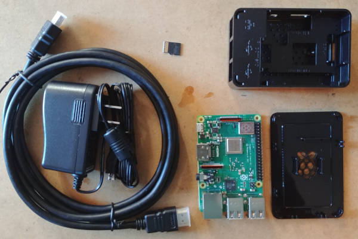

## Equipment

Perform these steps from a separate Windows, Mac or Linux computer.

1. Buy Raspberry Pi kit. I bought a [CanaKit](https://canakit.com) model from Amazon.
    
2. Download and install [Raspberry Pi Imager](https://www.raspberrypi.com/software/).
3. Make sure the newly purchased SD card is connected to your computer. In Raspberry Pi Imager, select:
   1. **Choose OS**
   2. Raspberry Pi OS (other) ▶ **Raspberry Pi OS Lite** (64-bit)
   4. **Choose Storage**
   5. Select your SD card. Check carefully for the correct choice and only proceed if 100% sure that the disk size matches your SD card.
   6. **Write**
4. From this point on, Windows will sometimes ask if you want to format the device. **Always say no.**
5. Insert the SD card into the Raspberry Pi board.
6. Connect keyboard and HDMI cable.
7. Connect the power supply last.

The initial setup will go through several screens and reboot once or twice. This is expected.


## First Boot

1. You will be prompted to create a username and password. Create them and remember them.
2. You will eventually see a prompt like `raspberrypi login:`. Log in with the username and password you created.
3. Type `sudo raspi-config` and press Enter. Navigate the menu:
   - **System Options** ▶ **Wireless LAN** — enter your Wi-Fi network name and passphrase.
   - **Localisation Options** ▶ **Timezone** — select the closest location.
4. Select **Finish**. You do not need to reboot yet.


## Install Mural

Run this single command:

```
curl -fsSL https://raw.githubusercontent.com/jassg-to/mural/main/install.sh | bash
```

The installer will:
- Install required packages (`cec-utils`)
- Add your user to the `video` and `input` groups, so Mural can talk to the display and the remote directly, without root
- Download the `mural` binary
- Create `~/mural/content/` with a sample schedule
- Install a udev rule that automatically mounts a USB stick plugged into the Pi, read-only, under `/media/mural/` — this is what makes the USB stick workflow below work
- Offer to configure **automatic startup** (autologin + auto-launch on boot)
- Offer to set up **Samba file sharing** so you can add images from any computer on your network

**If you installed Mural before this udev rule existed**, re-run the installer command above to get it. Without it, plugging in a USB stick does nothing — the Pi sees the block device but never mounts it.


## Add Your Images

If you enabled Samba during installation, open your file manager on any computer on the same network and go to `\\<pi-ip-address>\content`. You can drag and drop images directly.

Otherwise, copy JPG or PNG images into `~/mural/content/` over SSH, or plug in a USB stick — see [Update Content by USB Stick](#update-content-by-usb-stick) below.

Optionally edit `~/mural/content/config.toml` to set slideshow settings and the hours when the display should be on.


## Run

Log out and back in (or reboot) once, so your new `video`/`input` group membership takes effect. Then run:

```
~/mural/mural ~/mural/content
```

The slideshow will launch directly on the console — no window manager, no `startx`.

Left/Right navigate to the previous/next slide, Home jumps to the first slide, Delete puts the display to sleep, and Escape quits. Any other key wakes the display if it's asleep. The display will also turn off and on automatically according to your schedule.

> **Developing off the Pi?** Mural also runs on a regular Linux machine with the `-headless` flag, which writes each composited frame to a PNG file on disk instead of driving real display hardware — useful for iterating without a Pi and a monitor in front of you: `./mural -headless ~/mural/content`.


## Update Content by USB Stick

Once Mural is running, you can replace the sign's images (and its schedule) just by walking up and plugging in a USB stick — no keyboard, no network, no SSH.

**The stick must carry a `config.toml` at its top level, or it is ignored entirely.** This is what stops someone's personal flash drive, camera card, or phone from accidentally replacing the sign's content just by being plugged in — a stick with no `config.toml`, even one full of perfectly good images, is treated as though it was never inserted at all. Copy the sample `config.toml` from `~/mural/content/` onto the stick alongside your images as a starting point, and edit it to taste.

**Format the stick FAT32 or exFAT.** The automount rule only sets read/write permissions for the FAT family of filesystems; a stick formatted ext4 or NTFS may still mount, but its files can end up owned by root and unreadable to Mural. If that happens the symptom is an ingest failure recorded in the log, not anything visible on the sign.

What happens when you plug in a properly prepared stick:
- The display wakes immediately, even outside its scheduled hours, as your only on-screen confirmation that the stick was read.
- The images on the stick are copied onto the Pi and become the entire rotation — the sign's own copy of your images, not the stick playing directly.
- The stick's `config.toml` is adopted as the sign's schedule and slideshow settings, live, without a restart.
- You can then remove the stick — the sign keeps playing what was copied, indefinitely, including across reboots and power cuts.

A stick with no images, only a `config.toml`, is also accepted — it updates the schedule/settings and leaves the current images alone rather than blanking the sign.

**Recovering the previous content set.** The images and config a stick replaces are not deleted — they are kept in `~/mural/content/previous/`, accessible over the Samba share if you enabled it. Only the single most recently displaced set is kept; the next accepted stick with images overwrites it. To restore it:
1. Delete the images you no longer want from `~/mural/content/`.
2. Move the images you want back up out of `~/mural/content/previous/` into `~/mural/content/`.
3. Press Home on the keyboard/remote, or wait for the next scheduled turn-on — nothing rescans the content directory on its own until one of those happens.

Simply copying `previous/`'s files back on top of `content/` without first deleting the current ones will leave both sets mixed together, which is not what you want.

**A word on security.** A `config.toml` is a marker of intent, not a password — anyone who can plug something into the Pi's USB port can replace what the sign displays and change when it turns on. This is the same trust boundary as the keyboard already attached to the Pi, which can already pause the sign or quit the player. If you are siting a sign somewhere the public can reach its ports, keep that in mind.


## Automatic Startup

If you accepted the automatic startup option during installation, the Pi will launch the display on its own after every reboot. To reboot now:

```
sudo reboot
```

If you skipped that option and want to enable it later, re-run the installer:

```
curl -fsSL https://raw.githubusercontent.com/jassg-to/mural/main/install.sh | bash
```

Make sure you are logged in directly on the console (not over SSH) so the installer can detect the tty and offer the full setup.
