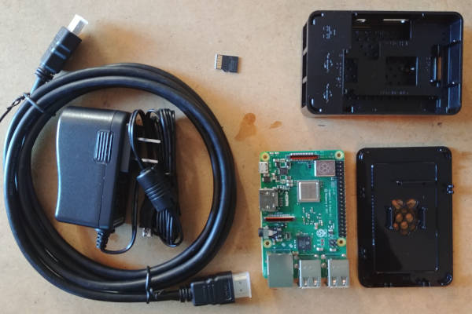
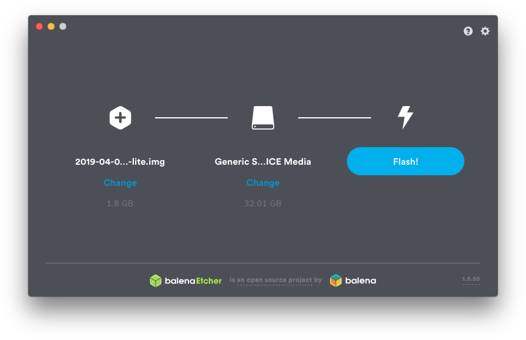
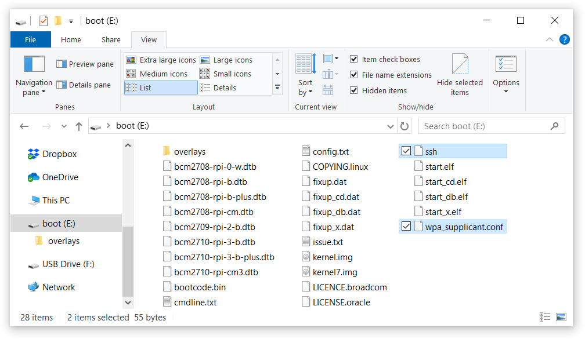

# Equipment

Perform these steps from a regular Windows, Mac or Linux computer.

Microsoft Windows does not come with an SSH client, so you'll need to install
    [PuTTY](https://www.chiark.greenend.org.uk/~sgtatham/putty).

1. Buy Raspberry Pi kit. I bought a [CanaKit](https://canakit.com) model from Amazon.
    
1. Download and install [Etcher](https://www.balena.io/etcher) or any other SD card flash tool.
1. Download [Raspbian Lite](https://www.raspberrypi.org/downloads/raspbian), unpack it, and flash the `.img` file.
    
1. After flashing is completed, eject and re-insert the SD card into your computer.
1. You should see a new device called "boot". We'll create some files here. Ignore other devices.
1. Create an empty file named `ssh`, no extension.
    [More info](https://www.raspberrypi.org/documentation/remote-access/ssh/).
1. Create a `wpa_supplicant.conf` file containing your WiFi configuration, like the example below.
    [More info](https://www.raspberrypi.org/documentation/configuration/wireless/wireless-cli.md).

```text
network={
    ssid="My WiFi network name"
    psk="My WiFi network passphrase"
}
``` 

After all these steps are done "boot" should have your files and a few dozen others, give or take.



Eject this device (do it in software first), and fit it in the specific SD card slot under the Raspberry Pi board.

You are now ready to assemble the rest of the Raspberry Pi kit and turn it on.
Remember to connect the power supply last.

# Operating System
